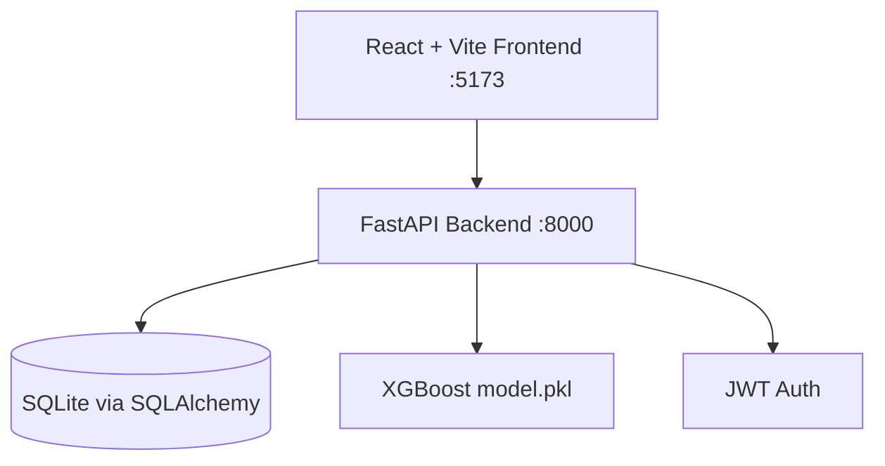

# Credit Risk Scoring Engine

Production-ready credit risk scoring web application built from the v2 specification:

- Frontend: React, Vite, Tailwind CSS, Recharts, Framer Motion
- Backend: single Python FastAPI app for auth, applications, and ML scoring
- Database: SQLite via SQLAlchemy, swappable with `DATABASE_URL`
- ML: XGBoost trained on synthetic credit-risk data and loaded with joblib
- Auth: JWT with hashed passwords and protected React routes
- No Docker required

## Local Setup

Backend:

```bash
cd backend
pip install -r requirements.txt
python train_model.py
uvicorn main:app --reload --port 8000
```

Frontend:

```bash
cd frontend
npm install
npm run dev
```

Open [http://localhost:5173](http://localhost:5173).

You can also run both dev servers from the repository root after installing frontend dependencies and Python requirements:

```bash
npm run dev
```

## Environment

Create `backend/.env` when deploying or sharing a persistent local setup:

```env
JWT_SECRET=replace-with-a-long-random-secret
DATABASE_URL=sqlite:///./backend/credit_risk.db
```

The frontend defaults to `http://localhost:8000`. Override with:

```env
VITE_API_URL=http://localhost:8000
```

## Architecture



## API

### Auth

- `POST /auth/register` creates a user and hashes the password with bcrypt.
- `POST /auth/login` returns a JWT access token.
- `GET /auth/me` returns the current authenticated user.

### Applications

- `POST /applications` creates an application and automatically scores it.
- `GET /applications` lists applications. Admins see all records; users see their own.
- `GET /applications/{id}` returns one application with the full score result.

### Scoring

`POST /score` accepts applicant JSON and returns:

```json
{
  "risk_score": 742,
  "risk_class": "LOW",
  "confidence": 91.4,
  "decision": "APPROVED",
  "top_features": [
    { "feature": "payment_history_score", "impact": 0.34 },
    { "feature": "debt_to_income_ratio", "impact": -0.21 }
  ],
  "reasoning": "Strong repayment profile and manageable debt burden."
}
```

Sample request:

```bash
curl -X POST http://localhost:8000/score \
  -H "Content-Type: application/json" \
  -d '{
    "name": "Avery Morgan",
    "age": 34,
    "employment_type": "Salaried",
    "annual_income": 96000,
    "employment_years": 6,
    "credit_history_length": 9,
    "num_credit_accounts": 5,
    "debt_to_income_ratio": 0.28,
    "existing_loans": 1,
    "num_delinquencies": 0,
    "payment_history_score": 88,
    "loan_amount": 28000,
    "loan_purpose": "auto",
    "tenure": 48
  }'
```

## Project Structure

```text
frontend/
  src/
    pages/        Landing, Login, Register, Dashboard, NewApplication, Results, ApplicationsList
    components/   Sidebar layout, ScoreGauge, StatsCounter, TestimonialCarousel
    api/          Axios instance with JWT interceptor
    context/      AuthContext
backend/
  main.py
  routers/
    auth.py
    applications.py
    score.py
  models.py
  schemas.py
  database.py
  auth_utils.py
  scoring.py
  train_model.py
  requirements.txt
```

Legacy `client/`, `server/`, and `src/` folders remain in the repository for reference. The v2 app described above is the active no-Docker implementation.
