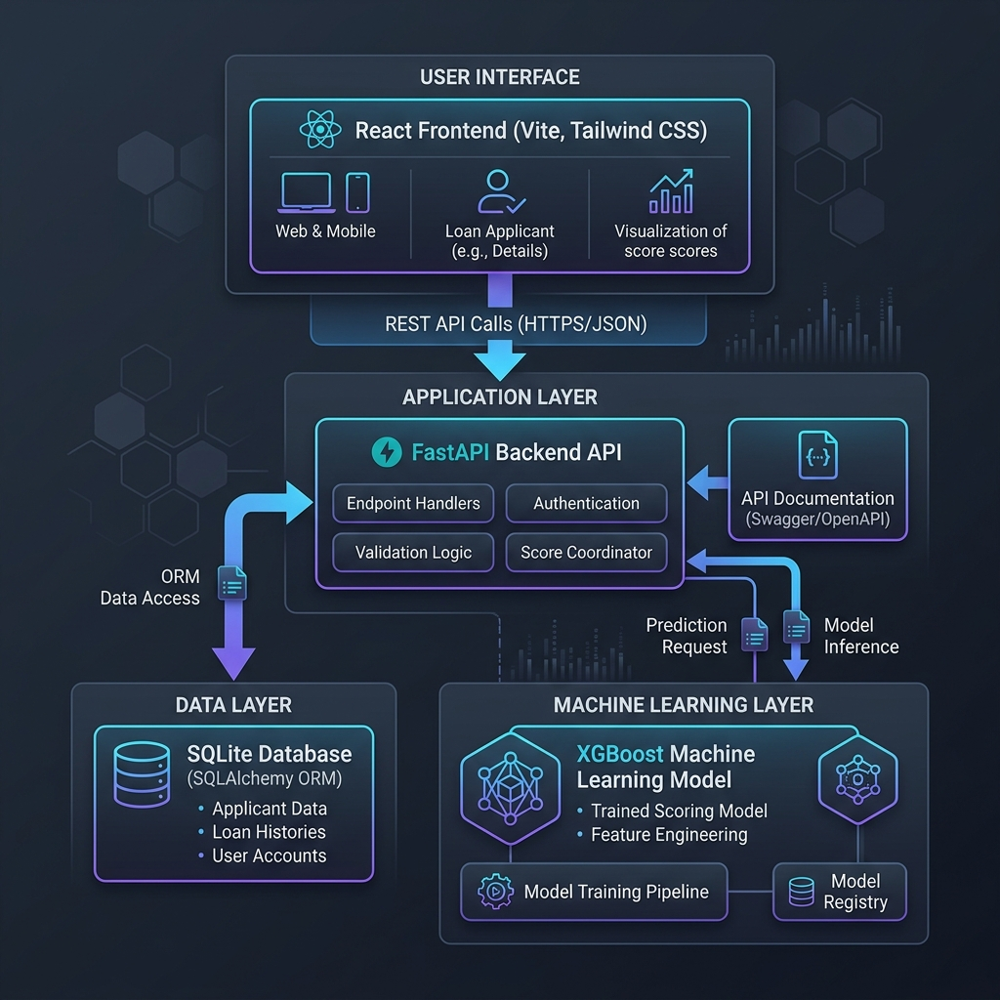
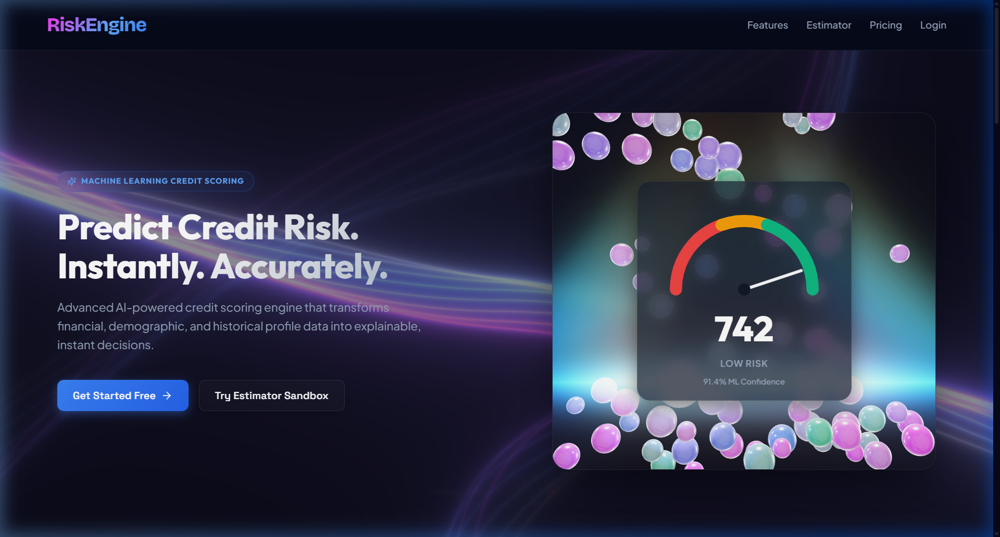
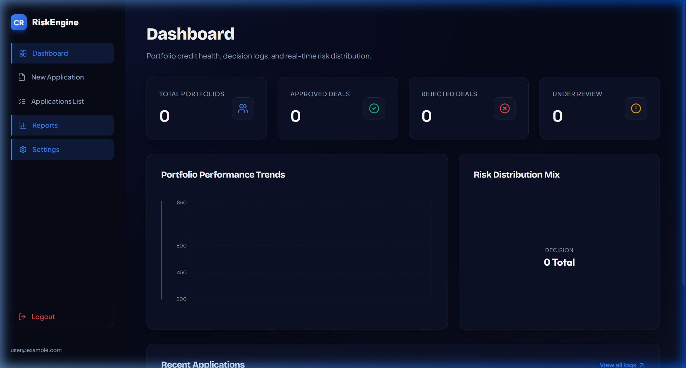
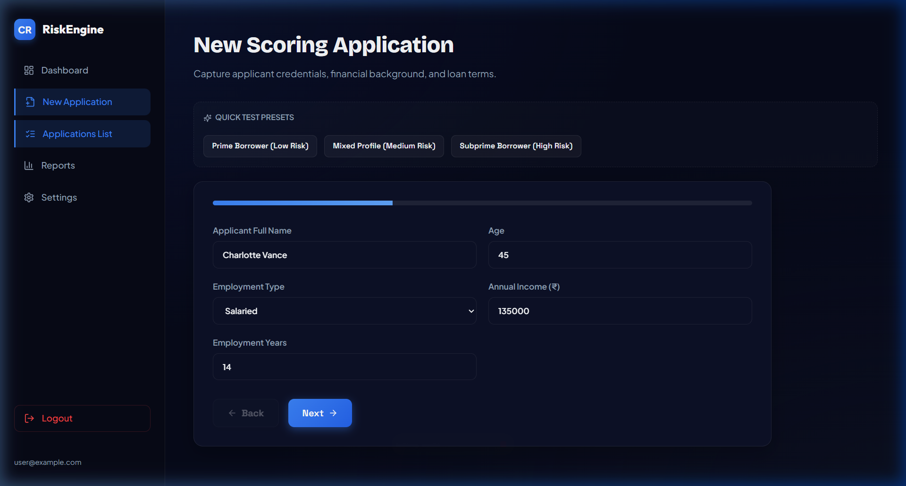
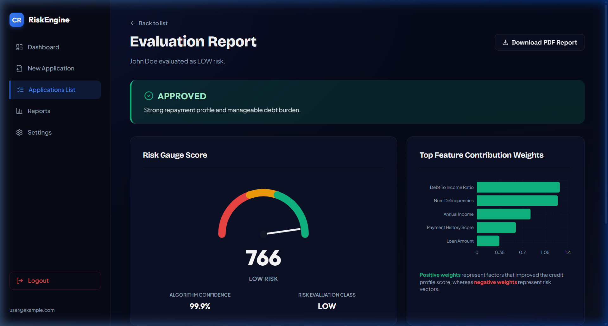

# 🛡️ Credit Risk Scoring Engine

[](#technology-stack)
[](#)
[](#)
[](#)

A production-ready, high-performance **Credit Risk Scoring Web Application** designed to evaluate borrower risk profiles in real-time. Combining a robust **FastAPI backend**, an interactive **React-Vite frontend**, and a custom-trained **XGBoost machine learning model**, this system generates explainable risk metrics in under 200ms.

---

## 🏗️ System Architecture

The application is structured around a decoupled, client-server design optimized for low-latency machine learning inference and relational record persistence. 

Below is the conceptual architecture showing how data flows from the client interfaces through the security layer to the scoring models and data tables:



### Architectural Components:
1. **React Frontend (Vite & Tailwind CSS)**: Single Page Application (SPA) utilizing modular states, custom gauges, interactive sliders, and Framer Motion transitions.
2. **FastAPI Backend**: A high-speed ASGI Python backend serving REST endpoints, executing JWT-based authentication guards, and orchestrating database transactions.
3. **Database Layer (SQLite & SQLAlchemy ORM)**: Stores user credentials, application states, risk score history, and model diagnostics. Easily swappable to PostgreSQL or MySQL.
4. **Scoring Engine (XGBoost & joblib)**: An ensemble gradient boosted tree model trained on structured credit characteristics, outputting continuous risk scores, risk levels (`LOW`, `MEDIUM`, `HIGH`), and localized feature importance explanations.

---

## 🖥️ Application Visuals & Walkthrough

Here is a look at the core interfaces built for the credit risk evaluation workspace:

### 1. Interactive Landing Page & Sandbox Scorer
The landing page features animations (using 3D rotating prisms and physics-driven particle ballpits) alongside an **Interactive Scorer Sandbox** that allows risk officers to simulate scores before registering:


### 2. Analyst Dashboard
Secure analyst workspace featuring high-level analytics cards (Accuracy, Volumes, Delinquency rates), quick actions, and an audit list of all processed loan applications:


### 3. Smart Application Form
A structured, step-by-step credit application form capturing borrower demographics, financial metrics, and payment records:


### 4. Credit Evaluation Report & Explainable AI
Upon submission, the engine presents an interactive evaluation report containing a high-fidelity score gauge, approval decision, prediction confidence, and feature importance impacts (identifying which positive or negative factors most influenced the model's decision):


---

## 🛠️ Local Setup & Installation

Follow these steps to run the backend engine and React frontend locally.

### Prerequisites
- **Python**: version `3.11` or higher
- **Node.js**: version `18` or higher
- **npm**: package manager

---

### Step 1: Clone the Repository
Clone this repository to your local machine and navigate into the root directory:
```bash
git clone https://github.com/your-username/credit-risk-scoring-engine.git
cd credit-risk-scoring-engine
```

---

### Step 2: Backend Setup & Model Training

1. **Create a Virtual Environment**:
   Initialize a Python virtual environment to isolate backend dependencies:
   ```bash
   python -m venv .venv
   ```

2. **Activate the Virtual Environment**:
   - **Windows (Command Prompt)**:
     ```cmd
     .venv\Scripts\activate.bat
     ```
   - **Windows (PowerShell)**:
     ```powershell
     .venv\Scripts\Activate.ps1
     ```
   - **macOS / Linux**:
     ```bash
     source .venv/bin/activate
     ```

3. **Install Python Packages**:
   Install the required libraries listed in `requirements.txt`:
   ```bash
   pip install -r requirements.txt
   ```

4. **Train the XGBoost Model**:
   Run the training script to generate the synthetic dataset, train the XGBoost classifier, evaluate its accuracy, and serialize the trained model (`model.pkl`):
   ```bash
   python backend/train_model.py
   ```
   *Note: This generates `backend/model.pkl` and sets up the baseline performance metric.*

5. **Start the FastAPI Backend Server**:
   Launch the FastAPI application using the Uvicorn ASGI server:
   ```bash
   uvicorn main:app --reload --port 8000 --app-dir backend
   ```
   The backend API documentation will be available at [http://127.0.0.1:8000/docs](http://127.0.0.1:8000/docs).

---

### Step 3: Frontend Setup & Dev Server

1. **Navigate to the Frontend Directory**:
   Open a new terminal tab/window and enter the frontend folder:
   ```bash
   cd frontend
   ```

2. **Install Node Packages**:
   Download and install the React packages and asset libraries:
   ```bash
   npm install
   ```

3. **Start the Vite Dev Server**:
   Start the local frontend server:
   ```bash
   npm run dev
   ```
   Open your browser to [http://localhost:5173](http://localhost:5173) to interact with the application.

---

### Alternative: Run Concurrently from Repository Root
If you have node packages installed in the frontend, you can run both backend and frontend dev servers concurrently from the root directory using:
```bash
npm install
npm run dev
```

---

## ⚙️ Configuration & Environment Variables

Configure the following environment files to customize database connections and security hashes.

### Backend Configurations
Create a `.env` file inside the `backend/` directory:
```env
JWT_SECRET=your-custom-secure-long-string-for-jwt-signing
DATABASE_URL=sqlite:///./backend/credit_risk.db
```
- `JWT_SECRET`: Standard HMAC-SHA256 signature secret for authentication.
- `DATABASE_URL`: SQLAlchemy connection string. Defaults to a local SQLite database file `credit_risk.db` in the backend folder.

### Frontend Configurations
Create a `.env` file inside the `frontend/` directory (if you need to override the default backend target):
```env
VITE_API_URL=http://localhost:8000
```

---

## 🔌 API Endpoints Documentation

The backend exposes structured REST endpoints for managing access, recording files, and evaluating risk calculations.

### 🔐 Authentication Router
- **`POST /auth/register`**: Registers a new user/analyst. Hashes passwords using `bcrypt`.
- **`POST /auth/login`**: Authenticates users and returns a JWT access token valid for 24 hours.
- **`GET /auth/me`**: Returns the current authenticated analyst profile (JWT validation required).

### 📁 Applications Router
- **`POST /applications`**: Submits a new loan application. Automatically triggers the ML model, saves borrower features, records evaluation score, and returns results.
- **`GET /applications`**: Lists historical applications. Regular users see their own; admin users see all records.
- **`GET /applications/{id}`**: Returns details of a specific application including the scoring breakdowns.

### 🧠 Raw Inference Scorer
- **`POST /score`**: Bypasses DB records to run a direct, raw scoring analysis on an applicant's payload.

#### Sample Raw Scorer Request:
```bash
curl -X POST http://localhost:8000/score \
  -H "Content-Type: application/json" \
  -d '{
    "name": "Jane Smith",
    "age": 34,
    "employment_type": "Salaried",
    "annual_income": 960000,
    "employment_years": 6,
    "credit_history_length": 9,
    "num_credit_accounts": 5,
    "debt_to_income_ratio": 0.28,
    "existing_loans": 1,
    "num_delinquencies": 0,
    "payment_history_score": 88,
    "loan_amount": 280000,
    "loan_purpose": "auto",
    "tenure": 48
  }'
```

#### Sample Raw Scorer Response:
```json
{
  "risk_score": 766,
  "risk_class": "LOW",
  "confidence": 92.8,
  "decision": "APPROVED",
  "top_features": [
    { "feature": "payment_history_score", "impact": 0.29 },
    { "feature": "debt_to_income_ratio", "impact": -0.15 },
    { "feature": "annual_income", "impact": 0.12 }
  ],
  "reasoning": "Strong payment history, low debt burden relative to income, and stable employment profile support a favorable risk assessment."
}
```

---

## 📂 Project Directory Structure

```text
├── backend/
│   ├── routers/             # API Router files (auth, applications, score)
│   ├── main.py              # Main FastAPI application entry point
│   ├── models.py            # SQLAlchemy database tables mapping
│   ├── database.py          # SQLAlchemy engine configuration
│   ├── schemas.py           # Pydantic input/output validation models
│   ├── auth_utils.py        # Bcrypt hashing and JWT encoding/decoding utilities
│   ├── scoring.py           # XGBoost inference logic & feature impact scaling
│   ├── train_model.py       # Script to train and serialize the ML model
│   └── requirements.txt     # Python backend dependencies list
├── frontend/
│   ├── src/
│   │   ├── pages/           # Pages: Landing, Login, Dashboard, NewApplication, Results
│   │   ├── components/      # Common UI: Sidebar, ScoreGauge, StatsCounter, Canvas visuals
│   │   ├── api/             # Axios API instance with Authorization Header interceptors
│   │   └── context/         # AuthContext provider for global auth state
│   ├── package.json         # Frontend Node package list
│   └── vite.config.js       # Vite build configurations
├── docs/
│   └── screenshots/         # Embedded application screenshots and diagrams
├── docker-compose.yml       # Docker configurations (optional reference)
├── package.json             # Root development configurations and startup commands
└── requirements.txt         # Root-level requirements reference
```
*Note: Legacy references `client/`, `server/`, and `src/` folders at the root are kept for history and compatibility purposes.*

